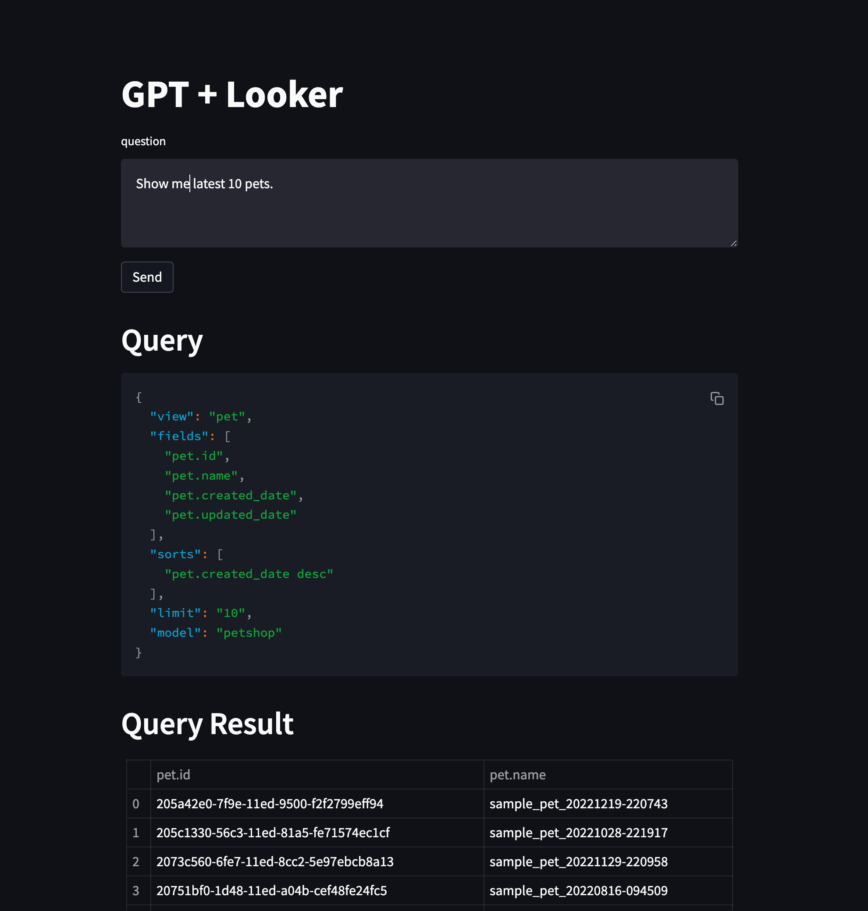

# Looker Data Access with Natural Language using OpenAI and LangChain



This repository contains a demo application that uses OpenAI and LangChain to interact with Looker and output data based on natural language questions in English and other languages.

## Features

- Retrieve data from Looker by asking questions in English and other languages
- Utilizes OpenAI and LangChain for language understanding and translation
- Converts natural language questions into Looker API requests using GPT-3 (text-davinci-003)
- Supports local LookML embeddings

## Getting Started

1. Clone this repository to your local machine.
1. Install the required dependencies using the following command:

    ```bash
    pip install -r requirements.txt
    ```

1. Place the `looker.ini` file in the root directory of the project.

1. Set the environment variables `LOOKER_MODEL_NAME` and `LOOKML_DIR` to the appropriate values for your Looker model and LookML directory:

    ```bash
    export LOOKER_MODEL_NAME=<your_looker_model_name>
    export LOOKML_DIR=<path_to_your_lookml_directory>
    export OPENAI_API_KEY=<your_openai_api_key>
    ```

1. Run app.py to start the Streamlit application:

    ```bash
    streamlit run app.py
    ```

1. Open the Streamlit application in your web browser using the provided URL.

## Usage

1. Input your question in the text box, either in English or any other natural language.
1. Press "Send" to send the question to the application.
1. The application will process the question using OpenAI and LangChain, converting it into a Looker API request.
1. View the retrieved data from Looker displayed on the screen.

## Future Work

- Integrate this application with ChatGPT to enable seamless communication between the two platforms and further enhance the natural language processing capabilities.
- Implement a smarter search indexing for Retrieval QA using [lkml](https://github.com/joshtemple/lkml) to improve the overall search experience.
- Integrate with [ChatGPT Plugin](https://platform.openai.com/docs/plugins/introduction).

## LICENSE

This project is licensed under the terms of the MIT license.
